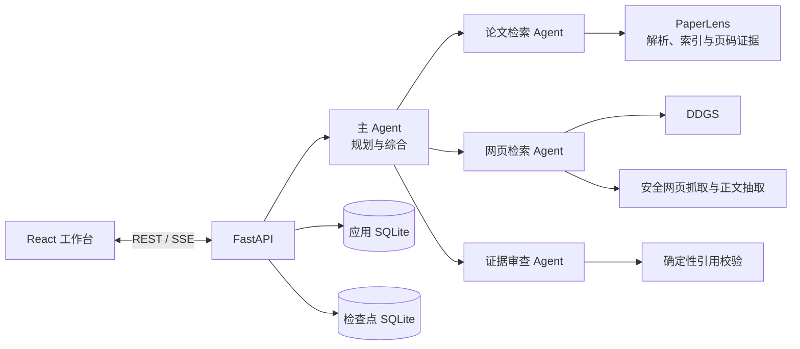

# ResearchAgent

> 基于 DeepAgents、PaperLens 与公开网页检索的本地科研深度研搜工作台。

ResearchAgent 面向论文阅读、研究问题梳理和多来源证据整合场景。用户可以选择本地论文、决定是否允许补充公开网页，然后由多个 Agent 完成研究规划、证据检索、草稿撰写、证据审查和引用校验，最终生成一份可追溯的中文 Markdown 回答。

项目采用本地优先架构：论文文件、研究会话、执行事件、来源和模型检查点均保存在本机。PaperLens 作为独立论文解析与检索服务运行，ResearchAgent 不复制其索引，也不直接修改 PaperLens 项目。

当前版本为 **V1**，定位为本机单用户研究工作台。

## 主要功能

- **多 Agent 研究流程**：主 Agent 负责任务规划与综合，论文、网页和证据审查 Agent 各自承担独立职责。
- **本地论文证据**：通过 PaperLens 检索论文原文，保留文档、章节、页码、bbox 和检索分数。
- **无 Key 网页研究**：使用 DDGS 搜索公开网页，并通过 `httpx + trafilatura` 提取正文。
- **可核验引用**：所有证据先持久化并分配稳定的 `[S1]`、`[S2]` 来源编号，再进入回答。
- **独立证据审查**：审查 Agent 检查引用存在性、结论支撑度、来源冲突和信息缺口。
- **实时执行轨迹**：通过 SSE 展示规划、工具调用、来源发现、审查和完成状态，并支持断线补发。
- **多轮研究会话**：使用 SQLite 保存会话、消息、研究任务、事件和来源，使用独立 SQLite 保存 LangGraph 检查点。
- **论文工作区**：前端支持论文上传、索引状态查看、多选、重命名、启停、重建、删除和原页预览。
- **故障隔离**：PaperLens 与 DDGS 任一路径不可用时，已获得的另一来源证据不会丢失。

## 工作流程



一次研究任务的基本生命周期：

1. API 保存研究问题并立即返回任务 ID。
2. 主 Agent 生成简短计划，并根据问题和所选论文决定信息源。
3. 子 Agent 获取证据；每条证据经过规范化、去重、编号和持久化。
4. 主 Agent 使用已保存来源形成带引用草稿。
5. 证据审查 Agent 进行一次审查，必要时最多修订一次。
6. 确定性校验移除未知引用，随后一次性发布最终回答。

更详细的内部设计见 [架构说明](docs/ARCHITECTURE.md)。

## 信息源路由

“允许补充公开网页”表示授权使用网页，并不代表每轮都必须搜索网页。

| 研究范围 | 实际行为 |
| --- | --- |
| 已选择论文，问题只询问论文内容 | 仅检索 PaperLens；已有本地证据后禁止网页搜索 |
| 已选择论文，并明确要求最新进展、外部资料或跨论文比较 | 同时允许本地论文与公开网页 |
| 已选择论文，但 PaperLens 失败或达到上限仍无证据 | 在用户允许网页时降级到公开网页 |
| 未选择论文且允许网页 | 使用公开网页研究 |
| 未选择论文且未允许网页 | 不进行外部检索，并在回答中说明证据限制 |

检索次数、证据数量和执行时间都有硬上限。并发论文请求会在任务内串行执行，并在获得足够证据后停止，避免重复检索和重试风暴。

## 技术栈

| 层级 | 技术 |
| --- | --- |
| Agent 编排 | DeepAgents 0.5.7、LangGraph、LangChain |
| 模型 | 支持工具调用的 OpenAI-compatible 服务 |
| 后端 | Python 3.12、FastAPI、SSE、SQLite |
| 本地论文 | PaperLens HTTP API |
| 公开网页 | DDGS、HTTPX、Trafilatura |
| 前端 | React 19、TypeScript、Vite |
| 测试 | Pytest、Vitest、Testing Library |

## 项目结构

```text
ResearchAgent/
├─ src/research_agent/
│  ├─ agent/             # Agent 提示词、运行时、工具和任务上下文
│  ├─ api/               # FastAPI 接口与后台任务管理
│  ├─ services/          # PaperLens、网页访问与引用校验
│  ├─ config.py          # 环境变量配置
│  ├─ db.py              # 应用 SQLite 持久化
│  └─ models.py          # 公共领域类型
├─ frontend/             # React / TypeScript 工作台
├─ tests/                # 后端单元与 API 集成测试
├─ scripts/              # 环境检查脚本
├─ docs/                 # 架构文档
├─ .env.example          # 配置模板
└─ pyproject.toml        # Python 项目与依赖
```

## 前置条件

- Python `3.12`
- Node.js `20+`
- pnpm
- 支持工具调用的 OpenAI-compatible 模型服务
- 可提供下列接口的 PaperLens 服务：

```text
POST /api/v1/agent/evidence-search
```

PaperLens 来自独立项目 [Research-Paper-RAG](https://github.com/gdisx088/Research-Paper-RAG)。两个项目应使用各自独立的 Python 环境，并通过 HTTP 通信。

## 安装

克隆本项目：

```bash
git clone https://github.com/gdisx088/ResearchAgent.git
cd ResearchAgent
```

创建并安装后端环境：

```bash
conda create -n ResearchAgent python=3.12 -y
conda activate ResearchAgent
python -m pip install -e ".[dev]"
```

安装前端依赖：

```bash
cd frontend
pnpm install
cd ..
```

## 配置

复制环境变量模板：

```bash
cp .env.example .env
```

PowerShell：

```powershell
Copy-Item .env.example .env
```

至少需要配置模型服务：

```dotenv
OPENAI_COMPATIBLE_BASE_URL=https://your-provider.example/v1
OPENAI_COMPATIBLE_API_KEY=your-api-key
OPENAI_COMPATIBLE_MODEL=your-tool-calling-model
```

主要配置项：

| 环境变量 | 默认值 | 说明 |
| --- | --- | --- |
| `PAPERLENS_BASE_URL` | `http://127.0.0.1:8000` | PaperLens 服务地址 |
| `PAPERLENS_WORKSPACE_ID` | `research-agent` | PaperLens 工作区 ID |
| `PAPERLENS_RERANKER_MODE` | `off` | Agent 检索是否使用本地 CrossEncoder 重排 |
| `RESEARCH_AGENT_DATA_DIR` | `./data/runtime` | SQLite 与运行时数据目录 |
| `RESEARCH_AGENT_MAX_MODEL_CALLS` | `20` | 每轮模型调用硬上限 |
| `RESEARCH_AGENT_MAX_LOCAL_SEARCHES` | `4` | 每轮论文检索硬上限 |
| `RESEARCH_AGENT_MAX_LOCAL_SOURCES` | `10` | 每轮本地论文证据上限 |
| `RESEARCH_AGENT_MAX_WEB_SEARCHES` | `6` | 每轮网页搜索硬上限 |
| `RESEARCH_AGENT_MAX_WEB_FETCHES` | `8` | 每轮网页正文抓取硬上限 |
| `RESEARCH_AGENT_DDGS_TIMEOUT_SECONDS` | `20` | 单次 DDGS 外层超时 |
| `PAPERLENS_TIMEOUT_SECONDS` | `180` | 单次 PaperLens 请求超时 |
| `RESEARCH_AGENT_EVIDENCE_TIMEOUT_SECONDS` | `180` | 每轮证据阶段时间预算 |
| `RESEARCH_AGENT_RUN_TIMEOUT_SECONDS` | `300` | 整个研究任务时间预算 |

`.env`、运行时数据库、前端构建产物和依赖目录均已加入 `.gitignore`，不会随代码提交。

如果需要访问已有 PaperLens 工作区中的论文，请把 `PAPERLENS_WORKSPACE_ID` 设置为对应工作区 ID；否则默认使用独立的 `research-agent` 工作区。

## 启动

需要分别启动 PaperLens、ResearchAgent API 和前端开发服务器。

### 1. 启动 PaperLens

在 PaperLens 项目和它自己的 Python 环境中执行：

```bash
python -m uvicorn research_paper_rag.api.app:app --host 127.0.0.1 --port 8000
```

### 2. 启动 ResearchAgent API

在本项目根目录执行：

```bash
conda activate ResearchAgent
python -m uvicorn research_agent.api.app:app --host 127.0.0.1 --port 8100 --reload
```

### 3. 启动前端

```bash
cd frontend
pnpm dev
```

访问 [http://127.0.0.1:5174](http://127.0.0.1:5174)。界面右上角会显示模型、PaperLens、DDGS 和持久化能力的当前状态。

> PaperLens 首次检索可能需要加载本地嵌入模型，因此冷启动会明显慢于后续请求。默认超时已为冷启动预留空间；建议在正式研究前确认 PaperLens 状态为可用。

## 基本使用

1. 在左侧创建或选择研究会话。
2. 上传论文，等待 PaperLens 完成解析和索引。
3. 选择本轮需要研究的论文。
4. 根据需要开启“允许补充公开网页”。
5. 输入研究问题并提交。
6. 在执行轨迹中查看规划、检索、来源和审查状态。
7. 在回答与证据面板中核对引用；论文来源可查看原页，网页来源可打开原始 URL。

任务执行期间可以取消。刷新页面或 SSE 断线后，客户端可以按事件 ID 补取遗漏事件；服务重启后，未完成任务会标记为 `interrupted`，不会自动恢复外部工具调用。

## API 概览

| 方法与路径 | 用途 |
| --- | --- |
| `GET /api/v1/health` | 服务健康检查 |
| `GET /api/v1/capabilities` | 查看模型、PaperLens、Web 和持久化能力 |
| `GET /api/v1/threads` | 获取研究会话 |
| `POST /api/v1/threads` | 创建研究会话 |
| `GET /api/v1/threads/{thread_id}` | 获取会话、消息与任务历史 |
| `POST /api/v1/threads/{thread_id}/runs` | 创建研究任务 |
| `GET /api/v1/runs/{run_id}` | 获取任务状态与最终回答 |
| `GET /api/v1/runs/{run_id}/events` | 订阅或补取 SSE 事件 |
| `POST /api/v1/runs/{run_id}/cancel` | 取消正在执行的任务 |
| `GET /api/v1/runs/{run_id}/sources` | 获取已保存来源 |
| `/api/v1/papers/*` | PaperLens 论文管理代理接口 |

创建研究任务的请求体：

```json
{
  "question": "比较这些论文在图对比学习防御中的设计取舍",
  "document_ids": ["doc_xxx", "doc_yyy"],
  "use_web": true
}
```

运行状态包括：

```text
queued | running | completed | failed | cancelled | interrupted
```

## 安全与可靠性

- Agent 使用状态型虚拟文件后端，不开放真实文件写入和 Shell 工具。
- 网页工具只允许 HTTP/HTTPS，并阻止 localhost、私网、回环和保留地址。
- 每次重定向都会重新验证目标地址，同时限制重定向次数、响应大小、内容类型和请求时间。
- PaperLens 请求采用任务级熔断，首次连接失败后不会通过更换关键词反复重试。
- DDGS 连续失败两次后，本轮网页搜索熔断。
- 论文检索在任务内串行执行，并在达到证据上限后停止排队请求。
- 最终回答只能引用本轮已持久化的来源 ID；未知引用会被确定性校验移除。
- 同一会话同时只允许一个活跃研究任务。

## 测试

运行后端测试：

```bash
python -m pytest -q
```

运行前端测试与生产构建：

```bash
cd frontend
pnpm test
pnpm build
```

默认测试使用假模型、HTTP mock 和固定证据，不调用真实 LLM、互联网或 PaperLens。环境与服务连接可以通过以下脚本检查：

```bash
python scripts/check_environment.py
```

## V1 限制

- 面向本机单用户，不包含账号系统、权限管理、多人协作和公网部署加固。
- 最终交付为带引用的聊天回答，不生成 Markdown 或 PDF 报告文件。
- 网页正文仅处理 HTML、纯文本和 XHTML，不直接解析远程 PDF。
- DDGS 是免费搜索入口，可能受到网络环境、地区和上游限流影响。
- 暂未集成 Tavily、专用学术元数据 API、MySQL、RAGFlow 或 Zotero。
- 模型和检索系统都可能犯错；重要结论仍应通过证据面板核对论文原页或网页原文。

## 设计参考

- [deepsearch-agents](https://github.com/didilili/deepsearch-agents)：从单 Agent、任务规划到多 Agent 深度研搜的建设流程参考。
- [Research-Paper-RAG](https://github.com/gdisx088/Research-Paper-RAG)：本项目使用的独立 PaperLens 论文解析与证据服务。

ResearchAgent 是在上述思路基础上的独立实现，重点补充了本地论文页码证据、来源路由、持久化 SSE、引用审查和工具安全边界。
